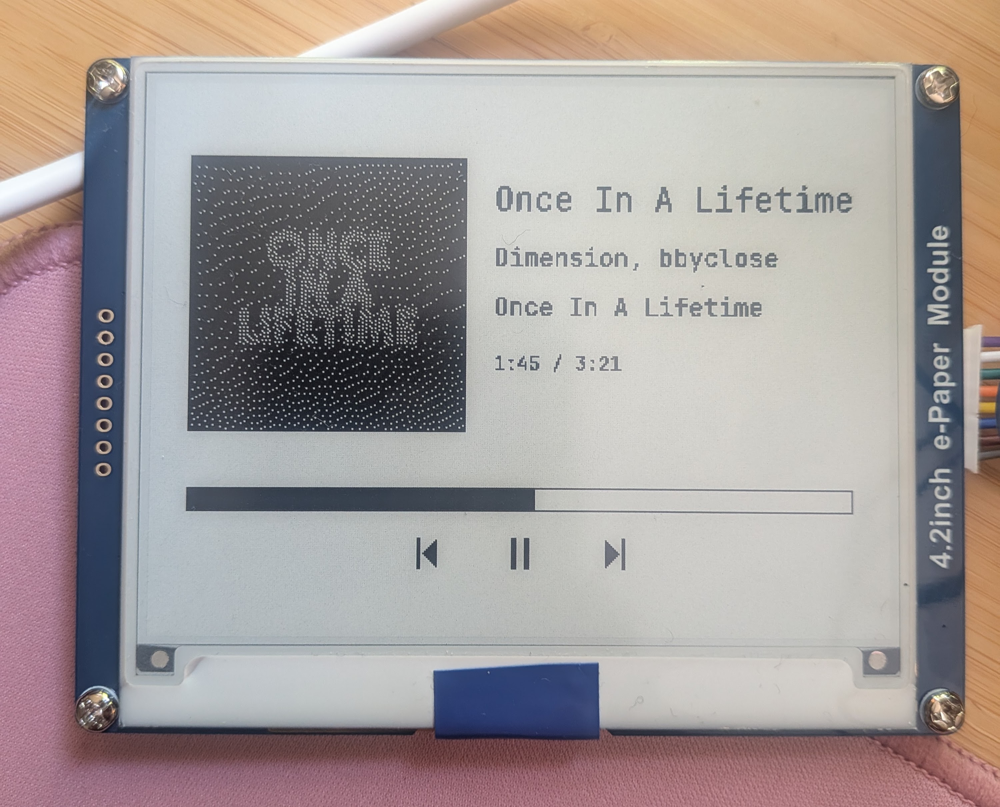
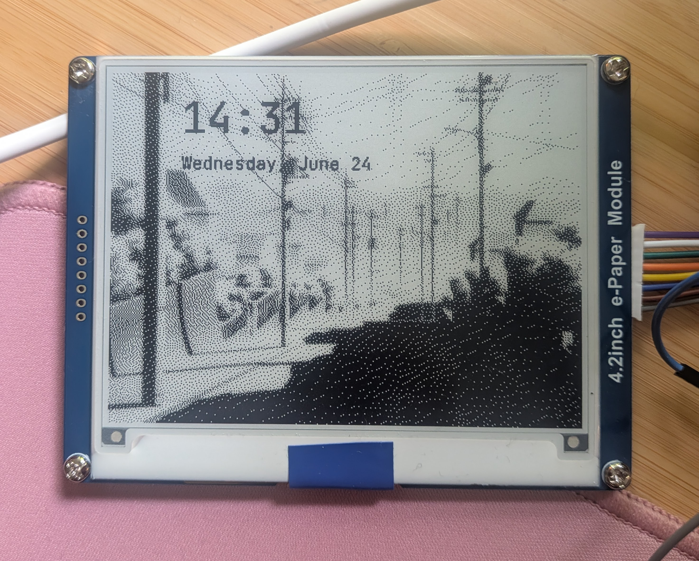

# waveshare-epaper

Rust no_std driver for the **Waveshare 4.2" e-Paper Module V2 Rev 2.2** (GDEY042T81, SSD1683) on ESP32-C3.

400×300 pixels, black/white, SPI interface.

Also includes a **music now-playing server** with Spotify and Navidrome backends, and a WiFi fetch example that displays the rendered framebuffer on the e-paper with touch controls.

<p>
  
  
</p>

## Wiring

ESP32-C3 SuperMini → Waveshare 4.2" module:

| GPIO | Function |
|------|----------|
| 0    | DIN (MOSI) |
| 1    | CLK (SCK) |
| 2    | CS |
| 5    | DC |
| 4    | RST |
| 10   | BUSY |
| 3V3  | VCC |
| GND  | GND |

Optional touch sensor (AT42QT1010):

| GPIO | Function |
|------|----------|
| 6    | OUT (touch) |
| 3V3  | VDD |
| GND  | GND |

Make sure the **BS** switch on the back of the module is set to **0** (4-wire SPI).

## Build & Flash

Requires the ESP32-C3 Rust toolchain ([espup](https://github.com/esp-rs/espup)):

```sh
# install toolchain (one-time)
cargo install espup espflash
espup install

# flash and monitor
cargo run --example demo
```

If `cargo run` doesn't auto-detect the port, specify it:

```sh
espflash flash --monitor --chip esp32c3 target/riscv32imc-unknown-none-elf/dev/examples/demo --port /dev/ttyACM0
```

## Examples

- **demo** — draws shapes, text, and a checkerboard pattern
- **fetch** — connects to WiFi, fetches a rendered framebuffer from the music server, displays it, and polls for touch input

```sh
# demo
cargo run --example demo

# fetch (requires wifi feature + env vars)
just fetch
```

## Music Server

An Axum web server that renders a "now playing" screen to a 1bpp framebuffer served over HTTP. Supports **Spotify** and **Navidrome** (Subsonic API) backends.

### Features

- Album art with Floyd-Steinberg dithering
- Track, artist, album text (JetBrains Mono)
- Progress bar (filled for Spotify, outline-only for Navidrome)
- Play/pause and prev/next transport icons
- Playback control via touch sensor: single tap = play/pause, double tap = next

### Server Endpoints

| Method | Path | Description |
|--------|------|-------------|
| GET    | /framebuffer | 15000-byte raw 1bpp framebuffer |
| POST   | /play-pause | Toggle Spotify playback |
| POST   | /next | Skip to next track |

### Setup

```sh
cd server
cp .env.example .env
# edit .env with your credentials
cargo run
```

For Spotify, you need a developer app with these scopes:
- `user-read-currently-playing`
- `user-read-playback-state`
- `user-modify-playback-state`

### systemd

```sh
sudo cp server/waveshare-epaper-server.service /etc/systemd/system/
sudo systemctl daemon-reload
sudo systemctl enable --now waveshare-epaper-server
```

## ESP32 WiFi Fetch

The `fetch` example connects to WiFi, polls `GET /framebuffer` every 5 seconds, and displays the result with partial refresh (full refresh every 60th cycle to clear ghosting).

Set the env vars in `.env` at the project root:

```sh
cp .env.example .env
# edit with your WiFi credentials and server IP
```

Use your machine's LAN IP for `SERVER_URL` (not `localhost` — the ESP is a separate device).

## Justfile Commands

| Command | Description |
|---------|-------------|
| `just demo` | Flash the demo example |
| `just fetch` | Flash the WiFi fetch example |
| `just server` | Run the music server |
| `just check` | Check firmware compiles |
| `just lint` | Format and lint everything |

## Driver API

```rust
use waveshare_epaper::ssd1683::{Ssd1683, FB_SIZE};

let mut display = Ssd1683::new(spi, cs, dc, rst, busy, delay, &mut framebuffer);
display.init()?;
display.clear_white();

// draw with embedded-graphics
use embedded_graphics::prelude::*;
// ... draw stuff ...

display.flush()?;         // full refresh (~3-4s, clean)
display.flush_fast()?;    // fast full refresh (~2s)
display.flush_partial()?; // partial refresh (~1s, may ghost)
display.sleep()?;         // deep sleep, wake with reset
```

Implements `DrawTarget<Color = BinaryColor>` from [embedded-graphics](https://docs.rs/embedded-graphics).

## Hardware Notes

- **Rev 2.2** uses the SSD1683 controller (GDEY042T81 panel), not the older IL0398. Older init sequences will not work.
- Busy pin is **active LOW** (LOW = busy, HIGH = idle).
- SSD1683 has dual RAM buffers (current + previous) enabling differential partial refresh.
- No custom LUTs needed — uses built-in OTP waveforms.
- On ESP32-C3, **avoid GPIO4–7 for input pins** — they are JTAG pins with internal pull-ups enabled by default that can interfere with signal reading.
- **AT42QT1010** touch sensor outputs HIGH on touch, LOW on idle. Capacitive touch works through thin non-metallic enclosure material (~3mm).
